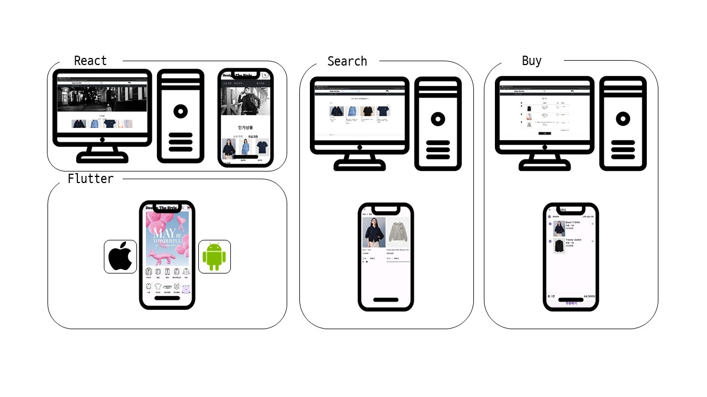

## 📋PC, 모바일, 태블릿에서 원활하게 작동하는 쇼핑몰
- Code
  - [Front-End (React)](https://github.com/pszzang123/capstone2024/tree/react)
  - [Front-End (Flutter)](https://github.com/pszzang123/capstone2024/tree/flutter)
  - [Back-End (Spring boot)](https://github.com/pszzang123/capstone2024/tree/main)
- Youtube
  - [Front-End (React-PC&Mobile)](https://youtu.be/yfDMVUe1erU?si=JNSLw1rHPB1y7Mf_)
  - [Front-End (IOS)](https://youtu.be/TC9KB3SaK5M)
  - [Front-End (Android)](https://www.youtube.com/watch?v=f7ISUhxcLwg)
- Doc
  - [기능 구성도](#기능-구성-및-시연-동영상)
  - [Rest API](./doc/backend/Backend-Document.md#rest-api)

 

## 📋목차

1. [개요](#개요)
2. [프로젝트 환경 설정 (개발환경)](#프로젝트-환경-설정-개발환경)
3. [기능 구성 및 시연 동영상](#기능-구성-및-시연-동영상)
4. [팀원별 역할](#팀원별-역할)
5. [기대 효과](#기대-효과)
6. [2023 수상작 비교](#2023-수상작-비교)
7. [9월 25일 한성공학경진대회 추가 발표 사항](#9월-25일-한성공학경진대회-추가-발표-사항)

 

## 📋개요

React와 SpringBoot를 활용한 웹 및 모바일웹 쇼핑몰과 Flutter를 통한 안드로이드 및 iOS 어플리케이션을 개발하여, 사용자가 PC, 모바일, 태블릿 등 어떤 기기에서도 원활하게 접속하고 쇼핑을 즐길 수 있도록 구성하였습니다. 이는 모바일 결제 비중의 증가에 따른 시장 요구를 충족시키기 위한 전략적 결정이며, 다양한 플랫폼 지원을 통해 사용자 경험을 극대화하는 것이 이 프로젝트의 핵심입니다.

 

## 📋프로젝트 환경 설정 (개발환경)

- 프레임워크 : React, Flutter, Spring Boot
- DBMS : MySQL & Firebase
- UI 환경 : PC 및 모바일 기기 (Android, IOS)

 

## 📋기능 구성 및 시연 동영상

 
 

<table>
  <tr>
    <th>카테고리</th>
    <th>주 기능</th>
    <th>세부 기능</th>
    <th>
      
    </th>
  </tr>
  <tr>
    <td rowspan="2">회원관리</td>
    <td rowspan="2">회원정보 관리</td>
    <td>로그인/로그아웃</td>
    <td rowspan="2">
      
      
      
    </td>
  </tr>
  <tr>
    <td>회원 가입/수정/탈퇴</td>
  </tr>
  <tr>
    <td rowspan="4">구매 관리</td>
    <td rowspan="2">장바구니 관리</td>
    <td>의류 등록/제거</td>
    <td rowspan="4">
      
      
      
    </td>
  </tr>
  <tr>
    <td>선택항목 구매</td>
  </tr>
  <tr>
    <td rowspan="2">구매내역 관리</td>
    <td>배송 내역 관리</td>
  </tr>
  <tr>
    <td>환불/주문취소 요청</td>
  </tr>
  <tr>
    <td rowspan="2">검색 관리</td>
    <td rowspan="2">의류 검색</td>
    <td>이름 검색</td>
    <td rowspan="2">
      
      
      
    </td>
  </tr>
  <tr>
    <td>카테고리 검색</td>
  </tr>
  <tr>
    <td rowspan="7">판매 관리</td>
    <td rowspan="2">판매자 정보 관리</td>
    <td>판매자 가입</td>
    <td rowspan="7">
      
      <!--
      
      
      -->
    </td>
  </tr>
  <tr>
    <td>판매자 로그인/로그아웃</td>
  </tr>
  <tr>
    <td rowspan="2">상품 관리</td>
    <td>상품 등록/수정/삭제</td>
  </tr>
  <tr>
    <td>등록 상품 조회</td>
  </tr>
  <tr>
    <td rowspan="2">주문 관리</td>
    <td>상품 별 주문 조회</td>
  </tr>
  <tr>
    <td>주문 상태 관리</td>
  </tr>
  <tr>
    <td>통계 조회</td>
    <td>상품 별 통계 조회</td>
  </tr>
</table>

 

## 📋팀원별 역할

<table>
  <tr>
    <th>이름</th>
    <th>주 개발</th>
    <th>세부 개발</th>
    <th>개발 환경</th>
    <th>Doc/Youtube</th>
  </tr>
  <tr>
    <td>김경훈</td>
    <td>Front-End 개발</td>
    <td>반응형 웹 개발</td>
    <td>
      
      
    </td>
    <td>
      
    </td>
  </tr>
  <tr>
    <td>김준기</td>
    <td>Front-End 개발</td>
    <td>Android App 개발</td>
    <td>
      
      
    </td>
    <td>
      
    </td>
  </tr>
  <tr>
    <td>김필수</td>
    <td>Front-End 개발</td>
    <td>IOS App 개발</td>
    <td>
      
      
    </td>
    <td>
      
    </td>
  </tr>
  <tr>
    <td>조성현</td>
    <td>Back-End 개발</td>
    <td>API 개발</td>
    <td>
      
      
    </td>
    <td>
      <a href="./doc/backend/Backend-Document.md">
        📋
      </a>
    </td>
  </tr>
</table>

 

## 📋기대 효과
모든 기기에서 원활한 쇼핑 경험을 제공함으로써 사용자 접근성을 대폭 향상시킬 것입니다. 또한, 다양한 플랫폼에서의 원활한 기능 제공을 통해 의류 쇼핑의 비대면 구매를 활성화하고, 이를 통해 시간과 장소에 구애받지 않는 편리한 쇼핑 환경을 조성할 것입니다.

 

## 📋2023 수상작 비교
<table>
  <tr>
    <th></th>
    <th>Design The Style</th>
    <th>
      2023 최우수상
       
      <a href="https://github.com/capstone-aloha">aloharoom</a>
    </th>
    <th>
      2023 우수상
       
      <a href="https://github.com/TeamCookCaps/FrontImageApp">Designer Image Web Application</a>
    </th>
    <th>
      2023 우수상
       
      <a href="https://github.com/godi00/capstone">FIND DOG</a>
    </th>
  </tr>
  <tr>
    <td>CODE</td>
    <td>O</td>
    <td>O</td>
    <td>O</td>
    <td>O</td>
  </tr>
  <tr>
    <td>DOC</td>
    <td>O</td>
    <td>O</td>
    <td>X</td>
    <td>X</td>
  </tr>
  <tr>
    <td>동영상</td>
    <td>O</td>
    <td>X</td>
    <td>X</td>
    <td>X</td>
  </tr>
  <tr>
    <td>Client</td>
    <td>React (Web, Mobile) IOS, Android</td>
    <td>React (Web, Mobile)</td>
    <td>React (Web, Mobile)</td>
    <td>React (Web, Mobile)</td>
  </tr>
</table>

 

## 📋9월 25일 한성공학경진대회 추가 발표 사항
1. 소비자가 의류를 선택할 때 도움을 줄 'Lookbook' 기능 추가
2. 회원 가입 시 보안 적용
3. 각 API에 권한 할당
4. CI/CD 자동화
5. AZURE, GCP 환경에서도 개발해보기
