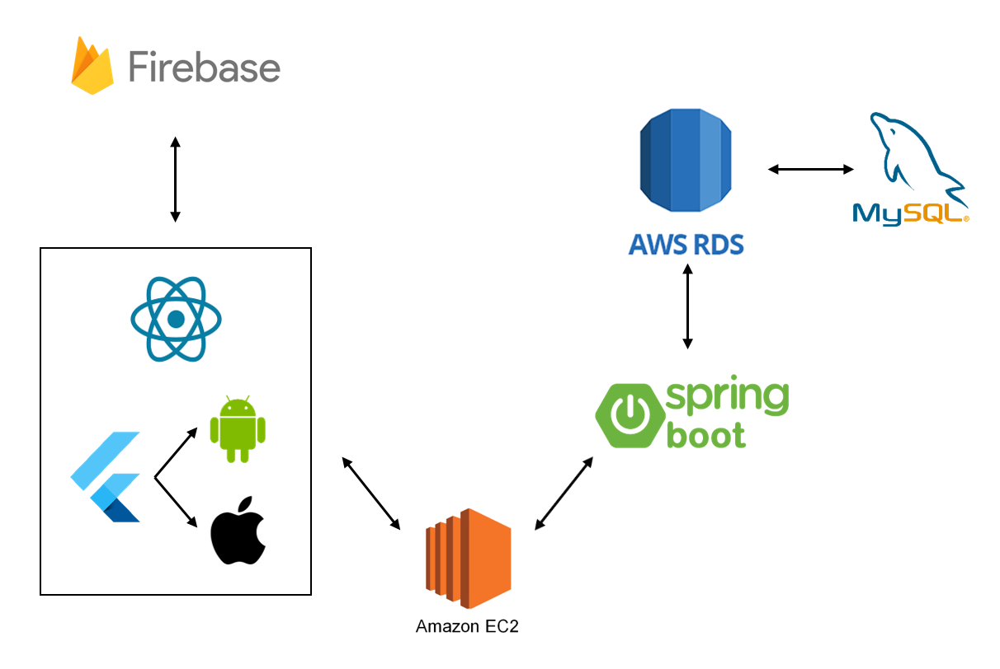

# Backend Document

## 📋목차

1. [프로젝트 구성](#프로젝트-구성)
2. [ERD](#erd)
3. [REST API](#rest-api)
4. [개선점](#개선점)

## 📋프로젝트 구성

 

## 📋ERD

 

## 📋REST API

1. [Cart](#cart)
2. [Clothes](#clothes)
3. [Clothes Detail](#clothes-detail)
4. [Clothes Images](#clothes-images)
5. [Comment](#comment)
6. [Customer](#customer)
7. [Likes](#likes)
8. [Major Category](#major-category)
9. [Receipt](#receipt)
10. [Receipt Detail](#receipt-detail)
11. [Sales](#sales)
12. [Seller](#seller)
13. [Sub Category](#sub-category)

<table>

<tr>
<th>API</th>
<th>HTTP 메서드</th>
<th>Request Body</th>
<th>Response Body</th>
<th>기능</th>
</tr>

<!--Cart-->
<tr>
<td colspan="5">

### Cart

</td>
</tr>

<tr>
  <td>

  `/api/cart`

  </td>
  <td>
    
  </td>
  <td>
    
  </td>
  <td>
    
  </td>
  <td>
    <a href="./api/cart/createCart.md">장바구니 추가</a>
  </td>
</tr>

<tr>
  <td>

  `/api/cart/{email}`

  </td>
  <td>
    
  </td>
  <td>
    .
  </td>
  <td>
    
  </td>
  <td>
    <a href="./api/cart/getCartByCustomerEmail.md">회원 장바구니 확인</a>
  </td>
</tr>

<tr>
  <td>

  `/api/cart`

  </td>
  <td>
    
  </td>
  <td>
    .
  </td>
  <td>
    
  </td>
  <td>
    <a href="./api/cart/getAllCart.md">모든 장바구니 확인</a>
  </td>
</tr>

<tr>
  <td>

  `/api/cart/{email}/{id}`

  </td>
  <td>
    
  </td>
  <td>
    
  </td>
  <td>
    
  </td>
  <td>
    <a href="./api/cart/updateCart.md">장바구니 수정</a>
  </td>
</tr>

<tr>
  <td>

  `/api/cart/{email}/{id}`

  </td>
  <td>
    
  </td>
  <td>
    .
  </td>
  <td>
    
  </td>
  <td>
    <a href="./api/cart/deleteCart.md">장바구니 제거</a>
  </td>
</tr>
<!--Cart-->

<!--Clothes-->
<tr>
<td colspan="5">

### Clothes

</td>
</tr>

<tr>
  <td>

  `/api/clothes`

  </td>
  <td>
    
  </td>
  <td>
    
  </td>
  <td>
    
  </td>
  <td>
    <a href="./api/cart/createCart.md">장바구니 추가</a>
  </td>
</tr>

<tr>
  <td>

  `/api/cart/{email}`

  </td>
  <td>
    
  </td>
  <td>
    .
  </td>
  <td>
    
  </td>
  <td>
    <a href="./api/cart/getCartByCustomerEmail.md">회원 장바구니 확인</a>
  </td>
</tr>

<tr>
  <td>

  `/api/cart`

  </td>
  <td>
    
  </td>
  <td>
    .
  </td>
  <td>
    
  </td>
  <td>
    <a href="./api/cart/getAllCart.md">모든 장바구니 확인</a>
  </td>
</tr>

<tr>
  <td>

  `/api/cart/{email}/{id}`

  </td>
  <td>
    
  </td>
  <td>
    
  </td>
  <td>
    
  </td>
  <td>
    <a href="./api/cart/updateCart.md">장바구니 수정</a>
  </td>
</tr>

<tr>
  <td>

  `/api/cart/{email}/{id}`

  </td>
  <td>
    
  </td>
  <td>
    .
  </td>
  <td>
    
  </td>
  <td>
    <a href="./api/cart/deleteCart.md">장바구니 제거</a>
  </td>
</tr>
<!--Clothes-->

<!--Clothes Detail-->
<tr>
<td colspan="5">

### Clothes Detail

</td>
</tr>

<tr>
  <td>

  `/api/cart`

  </td>
  <td>
    
  </td>
  <td>
    
  </td>
  <td>
    
  </td>
  <td>
    <a href="./api/cart/createCart.md">장바구니 추가</a>
  </td>
</tr>

<tr>
  <td>

  `/api/cart/{email}`

  </td>
  <td>
    
  </td>
  <td>
    .
  </td>
  <td>
    
  </td>
  <td>
    <a href="./api/cart/getCartByCustomerEmail.md">회원 장바구니 확인</a>
  </td>
</tr>

<tr>
  <td>

  `/api/cart`

  </td>
  <td>
    
  </td>
  <td>
    .
  </td>
  <td>
    
  </td>
  <td>
    <a href="./api/cart/getAllCart.md">모든 장바구니 확인</a>
  </td>
</tr>

<tr>
  <td>

  `/api/cart/{email}/{id}`

  </td>
  <td>
    
  </td>
  <td>
    
  </td>
  <td>
    
  </td>
  <td>
    <a href="./api/cart/updateCart.md">장바구니 수정</a>
  </td>
</tr>

<tr>
  <td>

  `/api/cart/{email}/{id}`

  </td>
  <td>
    
  </td>
  <td>
    .
  </td>
  <td>
    
  </td>
  <td>
    <a href="./api/cart/deleteCart.md">장바구니 제거</a>
  </td>
</tr>
<!--Clothes Detail-->

<!--Clothes Images-->
<tr>
<td colspan="5">

### Clothes Images

</td>
</tr>

<tr>
  <td>

  `/api/cart`

  </td>
  <td>
    
  </td>
  <td>
    
  </td>
  <td>
    
  </td>
  <td>
    <a href="./api/cart/createCart.md">장바구니 추가</a>
  </td>
</tr>

<tr>
  <td>

  `/api/cart/{email}`

  </td>
  <td>
    
  </td>
  <td>
    .
  </td>
  <td>
    
  </td>
  <td>
    <a href="./api/cart/getCartByCustomerEmail.md">회원 장바구니 확인</a>
  </td>
</tr>

<tr>
  <td>

  `/api/cart`

  </td>
  <td>
    
  </td>
  <td>
    .
  </td>
  <td>
    
  </td>
  <td>
    <a href="./api/cart/getAllCart.md">모든 장바구니 확인</a>
  </td>
</tr>

<tr>
  <td>

  `/api/cart/{email}/{id}`

  </td>
  <td>
    
  </td>
  <td>
    
  </td>
  <td>
    
  </td>
  <td>
    <a href="./api/cart/updateCart.md">장바구니 수정</a>
  </td>
</tr>

<tr>
  <td>

  `/api/cart/{email}/{id}`

  </td>
  <td>
    
  </td>
  <td>
    .
  </td>
  <td>
    
  </td>
  <td>
    <a href="./api/cart/deleteCart.md">장바구니 제거</a>
  </td>
</tr>
<!--Clothes Images-->

<!--Comment-->
<tr>
<td colspan="5">

### Comment

</td>
</tr>

<tr>
  <td>

  `/api/cart`

  </td>
  <td>
    
  </td>
  <td>
    
  </td>
  <td>
    
  </td>
  <td>
    <a href="./api/cart/createCart.md">장바구니 추가</a>
  </td>
</tr>

<tr>
  <td>

  `/api/cart/{email}`

  </td>
  <td>
    
  </td>
  <td>
    .
  </td>
  <td>
    
  </td>
  <td>
    <a href="./api/cart/getCartByCustomerEmail.md">회원 장바구니 확인</a>
  </td>
</tr>

<tr>
  <td>

  `/api/cart`

  </td>
  <td>
    
  </td>
  <td>
    .
  </td>
  <td>
    
  </td>
  <td>
    <a href="./api/cart/getAllCart.md">모든 장바구니 확인</a>
  </td>
</tr>

<tr>
  <td>

  `/api/cart/{email}/{id}`

  </td>
  <td>
    
  </td>
  <td>
    
  </td>
  <td>
    
  </td>
  <td>
    <a href="./api/cart/updateCart.md">장바구니 수정</a>
  </td>
</tr>

<tr>
  <td>

  `/api/cart/{email}/{id}`

  </td>
  <td>
    
  </td>
  <td>
    .
  </td>
  <td>
    
  </td>
  <td>
    <a href="./api/cart/deleteCart.md">장바구니 제거</a>
  </td>
</tr>
<!--Comment-->

<!--Customer-->
<tr>
<td colspan="5">

### Customer

</td>
</tr>

<tr>
  <td>

  `/api/customers`

  </td>
  <td>
    
  </td>
  <td>
    
  </td>
  <td>
    
  </td>
  <td>
    <a href="./api/customers/createCustomer.md">회원 가입</a>
  </td>
</tr>

<tr>
  <td>

  `/api/customers/{email}`

  </td>
  <td>
    
  </td>
  <td>
    .
  </td>
  <td>
    
  </td>
  <td>
    <a href="./api/customers/getCustomerByEmail.md">회원 정보 확인</a>
  </td>
</tr>

<tr>
  <td>

  `/api/customers/{email}/{password}`

  </td>
  <td>
    
  </td>
  <td>
    .
  </td>
  <td>
    
  </td>
  <td>
    <a href="./api/customers/checkCustomerByLoginInfo.md">로그인 정보 확인</a>
  </td>
</tr>

<tr>
  <td>

  `/api/customers/email/{email}`

  </td>
  <td>
    
  </td>
  <td>
    .
  </td>
  <td>
    
  </td>
  <td>
    <a href="./api/customers/checkCustomerByEmail.md">이메일 중복 확인</a>
  </td>
</tr>

<tr>
  <td>

  `/api/customers`

  </td>
  <td>
    
  </td>
  <td>
    .
  </td>
  <td>
    
  </td>
  <td>
    <a href="./api/customers/getAllCustomers.md">모든 회원 확인</a>
  </td>
</tr>

<tr>
  <td>

  `/api/customers/{email}`

  </td>
  <td>
    
  </td>
  <td>
    
  </td>
  <td>
    
  </td>
  <td>
    <a href="./api/customers/updateCustomer.md">회원 정보 수정</a>
  </td>
</tr>

<tr>
  <td>

  `/api/customers/{email}`

  </td>
  <td>
    
  </td>
  <td>
    .
  </td>
  <td>
    
  </td>
  <td>
    <a href="./api/customers/deleteCustomer.md">회원 탈퇴</a>
  </td>
</tr>
<!--Customer-->

<!--Likes-->
<tr>
<td colspan="5">

### Likes

</td>
</tr>

<tr>
  <td>

  `/api/cart`

  </td>
  <td>
    
  </td>
  <td>
    
  </td>
  <td>
    
  </td>
  <td>
    <a href="./api/cart/createCart.md">장바구니 추가</a>
  </td>
</tr>

<tr>
  <td>

  `/api/cart/{email}`

  </td>
  <td>
    
  </td>
  <td>
    .
  </td>
  <td>
    
  </td>
  <td>
    <a href="./api/cart/getCartByCustomerEmail.md">회원 장바구니 확인</a>
  </td>
</tr>

<tr>
  <td>

  `/api/cart`

  </td>
  <td>
    
  </td>
  <td>
    .
  </td>
  <td>
    
  </td>
  <td>
    <a href="./api/cart/getAllCart.md">모든 장바구니 확인</a>
  </td>
</tr>

<tr>
  <td>

  `/api/cart/{email}/{id}`

  </td>
  <td>
    
  </td>
  <td>
    
  </td>
  <td>
    
  </td>
  <td>
    <a href="./api/cart/updateCart.md">장바구니 수정</a>
  </td>
</tr>

<tr>
  <td>

  `/api/cart/{email}/{id}`

  </td>
  <td>
    
  </td>
  <td>
    .
  </td>
  <td>
    
  </td>
  <td>
    <a href="./api/cart/deleteCart.md">장바구니 제거</a>
  </td>
</tr>
<!--Likes-->

<!--Major Category-->
<tr>
<td colspan="5">

### Major Category

</td>
</tr>

<tr>
  <td>

  `/api/cart`

  </td>
  <td>
    
  </td>
  <td>
    
  </td>
  <td>
    
  </td>
  <td>
    <a href="./api/cart/createCart.md">장바구니 추가</a>
  </td>
</tr>

<tr>
  <td>

  `/api/cart/{email}`

  </td>
  <td>
    
  </td>
  <td>
    .
  </td>
  <td>
    
  </td>
  <td>
    <a href="./api/cart/getCartByCustomerEmail.md">회원 장바구니 확인</a>
  </td>
</tr>

<tr>
  <td>

  `/api/cart`

  </td>
  <td>
    
  </td>
  <td>
    .
  </td>
  <td>
    
  </td>
  <td>
    <a href="./api/cart/getAllCart.md">모든 장바구니 확인</a>
  </td>
</tr>

<tr>
  <td>

  `/api/cart/{email}/{id}`

  </td>
  <td>
    
  </td>
  <td>
    
  </td>
  <td>
    
  </td>
  <td>
    <a href="./api/cart/updateCart.md">장바구니 수정</a>
  </td>
</tr>

<tr>
  <td>

  `/api/cart/{email}/{id}`

  </td>
  <td>
    
  </td>
  <td>
    .
  </td>
  <td>
    
  </td>
  <td>
    <a href="./api/cart/deleteCart.md">장바구니 제거</a>
  </td>
</tr>
<!--Major Category-->

<!--Receipt-->
<tr>
<td colspan="5">

### Receipt

</td>
</tr>

<tr>
  <td>

  `/api/cart`

  </td>
  <td>
    
  </td>
  <td>
    
  </td>
  <td>
    
  </td>
  <td>
    <a href="./api/cart/createCart.md">장바구니 추가</a>
  </td>
</tr>

<tr>
  <td>

  `/api/cart/{email}`

  </td>
  <td>
    
  </td>
  <td>
    .
  </td>
  <td>
    
  </td>
  <td>
    <a href="./api/cart/getCartByCustomerEmail.md">회원 장바구니 확인</a>
  </td>
</tr>

<tr>
  <td>

  `/api/cart`

  </td>
  <td>
    
  </td>
  <td>
    .
  </td>
  <td>
    
  </td>
  <td>
    <a href="./api/cart/getAllCart.md">모든 장바구니 확인</a>
  </td>
</tr>

<tr>
  <td>

  `/api/cart/{email}/{id}`

  </td>
  <td>
    
  </td>
  <td>
    
  </td>
  <td>
    
  </td>
  <td>
    <a href="./api/cart/updateCart.md">장바구니 수정</a>
  </td>
</tr>

<tr>
  <td>

  `/api/cart/{email}/{id}`

  </td>
  <td>
    
  </td>
  <td>
    .
  </td>
  <td>
    
  </td>
  <td>
    <a href="./api/cart/deleteCart.md">장바구니 제거</a>
  </td>
</tr>
<!--Receipt-->

<!--Receipt Detail-->
<tr>
<td colspan="5">

### Receipt Detail

</td>
</tr>

<tr>
  <td>

  `/api/cart`

  </td>
  <td>
    
  </td>
  <td>
    
  </td>
  <td>
    
  </td>
  <td>
    <a href="./api/cart/createCart.md">장바구니 추가</a>
  </td>
</tr>

<tr>
  <td>

  `/api/cart/{email}`

  </td>
  <td>
    
  </td>
  <td>
    .
  </td>
  <td>
    
  </td>
  <td>
    <a href="./api/cart/getCartByCustomerEmail.md">회원 장바구니 확인</a>
  </td>
</tr>

<tr>
  <td>

  `/api/cart`

  </td>
  <td>
    
  </td>
  <td>
    .
  </td>
  <td>
    
  </td>
  <td>
    <a href="./api/cart/getAllCart.md">모든 장바구니 확인</a>
  </td>
</tr>

<tr>
  <td>

  `/api/cart/{email}/{id}`

  </td>
  <td>
    
  </td>
  <td>
    
  </td>
  <td>
    
  </td>
  <td>
    <a href="./api/cart/updateCart.md">장바구니 수정</a>
  </td>
</tr>

<tr>
  <td>

  `/api/cart/{email}/{id}`

  </td>
  <td>
    
  </td>
  <td>
    .
  </td>
  <td>
    
  </td>
  <td>
    <a href="./api/cart/deleteCart.md">장바구니 제거</a>
  </td>
</tr>
<!--Receipt Detail-->

<!--Sales-->
<tr>
<td colspan="5">

### Sales

</td>
</tr>

<tr>
  <td>

  `/api/cart`

  </td>
  <td>
    
  </td>
  <td>
    
  </td>
  <td>
    
  </td>
  <td>
    <a href="./api/cart/createCart.md">장바구니 추가</a>
  </td>
</tr>

<tr>
  <td>

  `/api/cart/{email}`

  </td>
  <td>
    
  </td>
  <td>
    .
  </td>
  <td>
    
  </td>
  <td>
    <a href="./api/cart/getCartByCustomerEmail.md">회원 장바구니 확인</a>
  </td>
</tr>

<tr>
  <td>

  `/api/cart`

  </td>
  <td>
    
  </td>
  <td>
    .
  </td>
  <td>
    
  </td>
  <td>
    <a href="./api/cart/getAllCart.md">모든 장바구니 확인</a>
  </td>
</tr>

<tr>
  <td>

  `/api/cart/{email}/{id}`

  </td>
  <td>
    
  </td>
  <td>
    
  </td>
  <td>
    
  </td>
  <td>
    <a href="./api/cart/updateCart.md">장바구니 수정</a>
  </td>
</tr>

<tr>
  <td>

  `/api/cart/{email}/{id}`

  </td>
  <td>
    
  </td>
  <td>
    .
  </td>
  <td>
    
  </td>
  <td>
    <a href="./api/cart/deleteCart.md">장바구니 제거</a>
  </td>
</tr>
<!--Sales-->

<!--Seller-->
<tr>
<td colspan="5">

### Seller

</td>
</tr>

<tr>
  <td>

  `/api/cart`

  </td>
  <td>
    
  </td>
  <td>
    
  </td>
  <td>
    
  </td>
  <td>
    <a href="./api/cart/createCart.md">장바구니 추가</a>
  </td>
</tr>

<tr>
  <td>

  `/api/cart/{email}`

  </td>
  <td>
    
  </td>
  <td>
    .
  </td>
  <td>
    
  </td>
  <td>
    <a href="./api/cart/getCartByCustomerEmail.md">회원 장바구니 확인</a>
  </td>
</tr>

<tr>
  <td>

  `/api/cart`

  </td>
  <td>
    
  </td>
  <td>
    .
  </td>
  <td>
    
  </td>
  <td>
    <a href="./api/cart/getAllCart.md">모든 장바구니 확인</a>
  </td>
</tr>

<tr>
  <td>

  `/api/cart/{email}/{id}`

  </td>
  <td>
    
  </td>
  <td>
    
  </td>
  <td>
    
  </td>
  <td>
    <a href="./api/cart/updateCart.md">장바구니 수정</a>
  </td>
</tr>

<tr>
  <td>

  `/api/cart/{email}/{id}`

  </td>
  <td>
    
  </td>
  <td>
    .
  </td>
  <td>
    
  </td>
  <td>
    <a href="./api/cart/deleteCart.md">장바구니 제거</a>
  </td>
</tr>
<!--Seller-->

<!--Sub Category-->
<tr>
<td colspan="5">

### Sub Category

</td>
</tr>

<tr>
  <td>

  `/api/cart`

  </td>
  <td>
    
  </td>
  <td>
    
  </td>
  <td>
    
  </td>
  <td>
    <a href="./api/cart/createCart.md">장바구니 추가</a>
  </td>
</tr>

<tr>
  <td>

  `/api/cart/{email}`

  </td>
  <td>
    
  </td>
  <td>
    .
  </td>
  <td>
    
  </td>
  <td>
    <a href="./api/cart/getCartByCustomerEmail.md">회원 장바구니 확인</a>
  </td>
</tr>

<tr>
  <td>

  `/api/cart`

  </td>
  <td>
    
  </td>
  <td>
    .
  </td>
  <td>
    
  </td>
  <td>
    <a href="./api/cart/getAllCart.md">모든 장바구니 확인</a>
  </td>
</tr>

<tr>
  <td>

  `/api/cart/{email}/{id}`

  </td>
  <td>
    
  </td>
  <td>
    
  </td>
  <td>
    
  </td>
  <td>
    <a href="./api/cart/updateCart.md">장바구니 수정</a>
  </td>
</tr>

<tr>
  <td>

  `/api/cart/{email}/{id}`

  </td>
  <td>
    
  </td>
  <td>
    .
  </td>
  <td>
    
  </td>
  <td>
    <a href="./api/cart/deleteCart.md">장바구니 제거</a>
  </td>
</tr>
<!--Sub Category-->

</table>

 

## 📋개선점
1. API 권한 추가
2. User 회원가입 시 Password 암호화